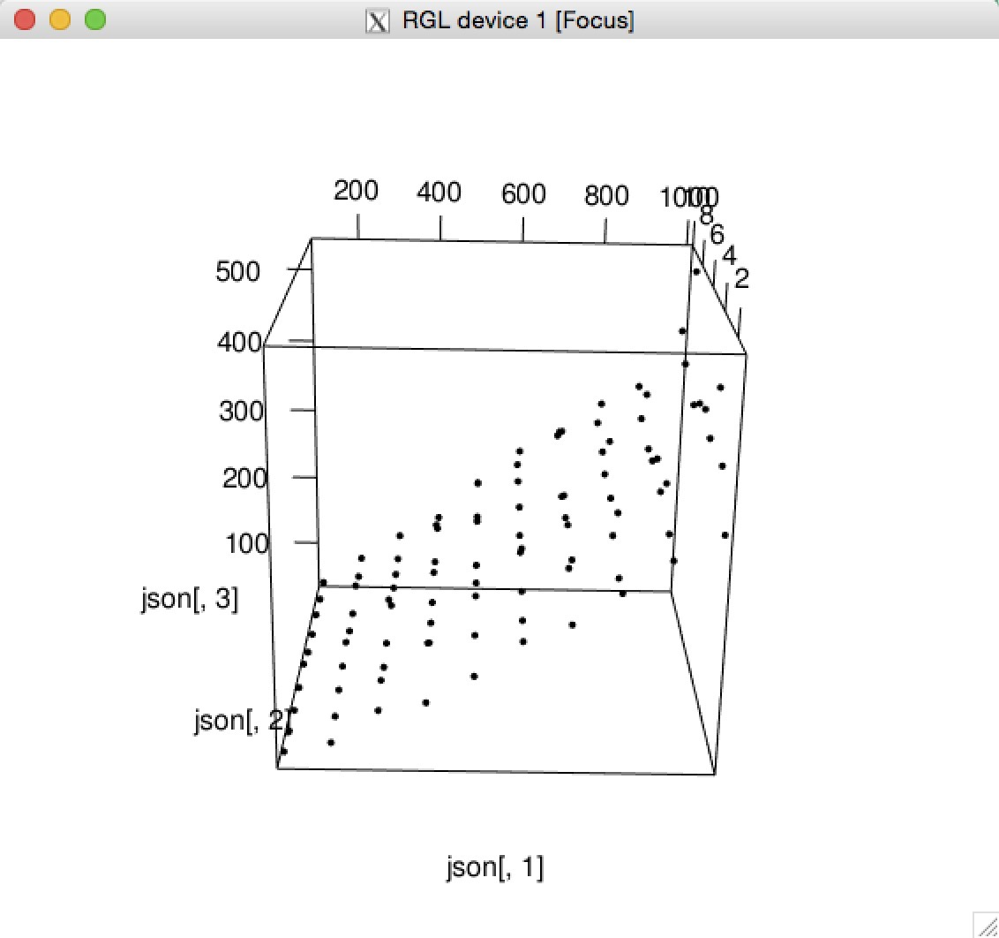

## 1. Introduction
There is no production or result about my research now, so I want to talk about a framework. This framework can be found in my github (https://github.com/lm2343635/Mengular), which includes 2 parts: JavaScript Ajax Loading and Java Template Engine. In this report, I will compare two loading method in the function of JavaScript ajax table loading (I will call it ajax table loading from now). At first, I will explain the meaning of ajax table loading. 

For traditional web development, we use PHP, Java, ASP .NET and other programming language for background service program, they have to prepare their own template file such as jsp file in Java Web development. To create a table, code in jsp would like this:
```html

    <table>
    	<tbody>
    	<%
    	for(Item item in items) {
    		%>
    		<tr>
    			<td><%=item.attribute_1%></td>
    			<td><%=item.attribute_2%></td>
    			...
    			<td><%=item.attribute_n%></td>
    		</tr>
    		<%
    	}
    	%>
    	</tbody>
    </table>
```
This style is same in PHP and other background service programming, which is difficult to read, especially for front end Engineer who only care about browser side. This style is not comply with MVC(Model-View-Controller) standard. And we can image a situation that a table has many rows, for instance, more than 10000 rows. It is no doubt that we could not use such style to show this 10000 rows in a html documents because it is too scroll to create this html document and transfer it to browser. If we can load 100 rows at first, and when we scroll the page down, more 100 rows are loaded dynamically by ajax, things will be better. In fact, peoples are doing like this method. Web applications of Google photos will not load all your photos, when you scroll it down, more photos will be loaded automatically. 

The question is how to create dom element dynamically after loading table data asynchronously There is a function called `$.append()` in jQuery framwork which can append a child element to a parent element, the core question is how to create this child element. We can call a function `document.createElement()` provided by native Javascript API or the equal function in jQuery like `$("<tr>")`. However, this method is just suitabled for such simple situations. With the increment of child element's complexity, a lots of html document is written in javascript which is not convenient to read and rewrite. Thus, we hope a template egine for front end development just like the same thing in background service programming. 

## 2. Goal
At first, we prepare a template as which has been introduced in part 1.
```html

    <table id="example-table">
      <tbody>
        <tr id="${id}$" class="mengular-template example-table-template">
            <td>${attribute_1}$</td>
        		<td>${attribute_1}$</td>
        		...
        		<td>${attribute_1}$</td>
        </tr>
      </tbody>
    </table>
```
The row document `<tr>` is the part that we want to load asynchronously. It has two classes incuding `mengular-template` which is defined in `mengular.css` in order to instruct the element is a row template, and `example-table-template` which is assigned by ourself for finding template element. Then we can user the core function `$.mengular(template, data)`(it is a jQuery style function) in Mengular framework to load data. This function has two parameters: the first parameter `template` is the css selector of template dom elemtent you want to use, and the second parameter `data` is the data of row which can be a json object or a json array. A json object represent the data of one row, while a json array represent the data if multiple row. My goal is to compare the time of using json object and json array to load table. For instance, there is a json array named `items` downloaded from server asynchronously. We use json object as sencond parameter:
```javascript

    for(var item of items) {
      $("#example-table").(".example-table-template", item);
    }
```
or use json array as second parameter

    $("#example-table").(".example-table-template", items);
You might think that the first method has no meaning because it is just a for-each loop compared to the second method. However, when we consider a situation to bind some event to the dom element, it is more convinient to do this in the first method like this:
```javascript

    for(var item of items) {
      $("#example-table").(".example-table-template", item);
      
      /**
      Bind a click event for this `<tr>` dom element. There is an id attribute 
      `id="${id}$"` in `<tr>` dom element which is replaced by `item.id`. Thus 
      we can use jQuery selector `$("#" + item.id)`, to get this dom element in
      order to bind a event for it.
      **/
      $("#" + item.id).click(function() {
        //Do something...
      });
    }
```
If we use the second method, we shoud bind event after dom element loaded:
```javascript

    $("#example-table").(".example-table-template", items);
    for(var item in items) {
      $("#"+item.id).click(function() {
        //Do something...
      });
    }
```
## 3. Hypothesis
Based on this goal, I want to compare the run time of the two method using json object and using json array. Some factors like the number of rows and the number of events need to bind will influence the result. My hypohesis is:

  H1: Using json object is better than using json array.
  
  H2: Using json array is better than using json object.

The run time of loading rows is evaluation standard of these two method. In other words, the faster it runs, the better it is.

## 4. Experiments
To test the run time of it, I designed an experiment. The source code of this experiment can be found in `Mengular`'s github repository(https://github.com/lm2343635/Mengular/blob/master/WebContent/testArray.html, https://github.com/lm2343635/Mengular/blob/master/WebContent/testObject.html). I concentrated on two factors introduced above: number of rows and the number of events. Number of rows is from 100 to 1000, which means there are how many rows in the table. Numbers of events if from 1 to 10, which means there are how many events binded to `<tr>` dom element. In this experiment, all javascript events are onclick events binded with jQuery function `$.click()`. The unit of test time is millisecond. For each method, there are 100 results of function run time. I saved each 100 results to a txt file as the format of $Nr Ne T$, $Nr$ means number of runtime, $Ne$ means number of events and $T$ means the run time. 

Next, I am going to test the function relationship between $T$, $Nr$ and $Ne$. I combined the two txt file together at first. Then I use `lsfit` to analyze the relationship between them.
```r

> json.object <- read.table("~/Desktop/jo.txt")
> json.array <- read.table("~/Desktop/ja.txt")
> json <- cbind(json.array,json.object[,3])
> ls.out.ja <- lsfit(cbind(json[,1],json[,2]),json[,3])
> ls.out.jo <- lsfit(cbind(json[,1],json[,2]),json[,4])
```
Linear regression was carried out with the results and a prediction model is given. For the method of using json array,
```r

Residual Standard Error=26.5854
R-Square=0.9472
F-statistic (df=2, 97)=870.2351
p-value=0

          Estimate Std.Err t-value Pr(>|t|)
Intercept -20.5000  7.6745 -2.6712   0.0089
X1          0.3848  0.0093 41.5724   0.0000
X2          3.2339  0.9256  3.4939   0.0007
```
and for the method of using json object:
```r

Residual Standard Error=38.929
R-Square=0.9652
F-statistic (df=2, 97)=1344.037
p-value=0

          Estimate Std.Err t-value Pr(>|t|)
Intercept -72.5233 11.2378 -6.4535    0e+00
X1          0.7006  0.0136 51.6947    0e+00
X2          5.3752  1.3553  3.9659    1e-04
```
From `R-Square` we can conclude that $t=f(Nr, Ne)$ is nearly a linear function. In other words, The run time is linear with number of rows and number of events. We can get linear equation of the two method:

Using json array: $Ta=-20.5000+0.3848*Nr+3.2339*Ne$

Using json object: $To=--72.5233+0.7006*Nr+5.3752*Ne$
In first octant, To is always bigger than Ta, which means using json array runs faster than using json array. There are plot of the two method


